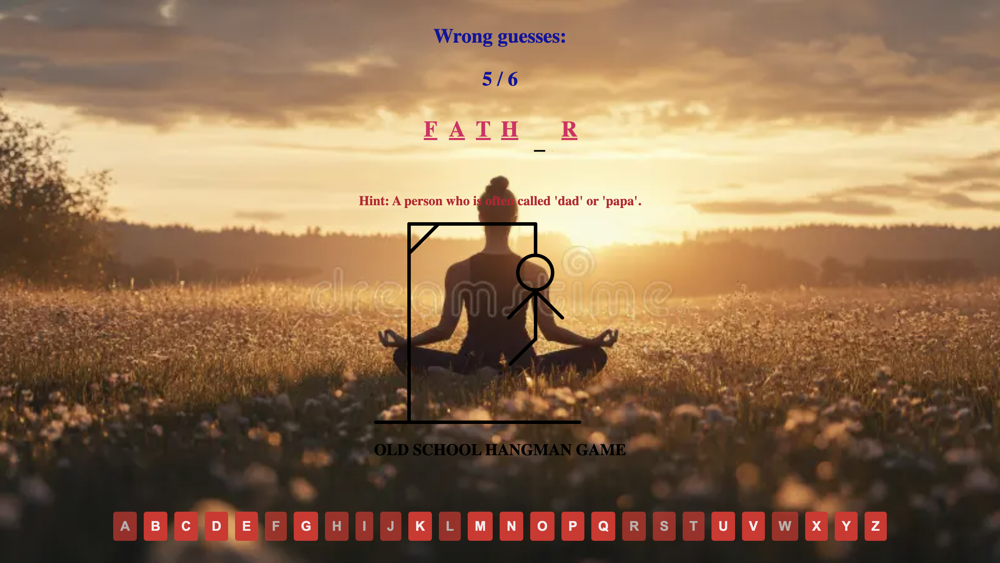

Old School Hangman Game

Screenshot

Technologies used: JavaScript, HTML, CSS 

My project will be based on the classic game of “Hangman.” The primary objective of this game is to correctly identify a secret word or phrase. Players have a total of six opportunities to guess letters from the alphabet. Each incorrect guess results in adding a body part to the hangman figure (head, torso, two arms, and two legs). If all six attempts are used without successfully guessing the word or phrase, then youDescription of the Game: Hangman
The classic game of Hangman challenges players to deduce a secret word or phrase by guessing letters from the alphabet. The objective is to successfully identify the hidden word or phrase before exhausting all available attempts. Players are given a total of six opportunities to guess letters. For each incorrect guess, a part of the hangman figure—a head, torso, arms, or legs—is drawn. If the entire figure is completed before the word is guessed, the player loses the game.

The game is responsive to different window sizes, built with HTML, CSS, and javascript.

How to Play:

At the start of the game, the secret word or phrase is represented as a series of blank spaces or underscores, indicating the number of letters in the word.
Players guess one letter at a time.
If the guessed letter is correct, it is revealed in the corresponding blank space(s) of the word.
If the guessed letter is incorrect, a body part is added to the hangman figure, and the player loses one of their six chances.
Once a letter is guessed, it is highlighted to indicate it has already been selected. This prevents the player from selecting the same letter again.
The game ends in one of two ways:
Victory: The player successfully guesses all the letters in the word or phrase before the hangman figure is fully drawn.
Defeat: The hangman figure is completed, representing the six incorrect guesses, before the player identifies the word.
Additional Rules and Features:

User stories

// As a user I should be able to enter my own letters.
// As a user I should be able to see all the available alphabet letters.
// As a user I should see the letters guess change so I know what was guesses and left to guess
// As a user I can click a button and generate a word for me to guess
// As a user I should start the game with 6 lives
// As a user I want to view the website and content clearly on any device.
// As a user I want to have instructions on how to play the game so that I can easily understand 
the rules.
// As a user I want to be able to start a game when I am ready.
// As a user I want to see a hangman image appear as I guess correctly.
// As a user I want to know whether my guess was successful or not.
// As a user I want to see contact information for the site owner incase I want to reach out with 
any queries I have about the site.
// As a user I want to see other work the site owner has created.

Reflection and Future Improvements:

In the future, I plan to enhance the project by introducing a timer to increase the level of challenge. Players will be required to complete each round within a set time limit, with the timer progressively decreasing after every successful round, adding an element of urgency and strategy to the gameplay. Additionally, I intend to implement a feature allowing players to customize their gaming experience by selecting their preferred theme and color schemes.

To further improve the visual appeal and interactivity, I will incorporate a broader range of colors and animations. These enhancements will make the interface more vibrant, dynamic, and engaging, creating a more immersive and enjoyable experience for the players.

Rescources and Learning Process:
Chat Gpt,
Online Searches,
Stack Overflow,
Python Forum.

License
Distributed under the MIT License.  See LICENSE for more information.

Contact
Email me at: hoangducsteven@gmail.com
